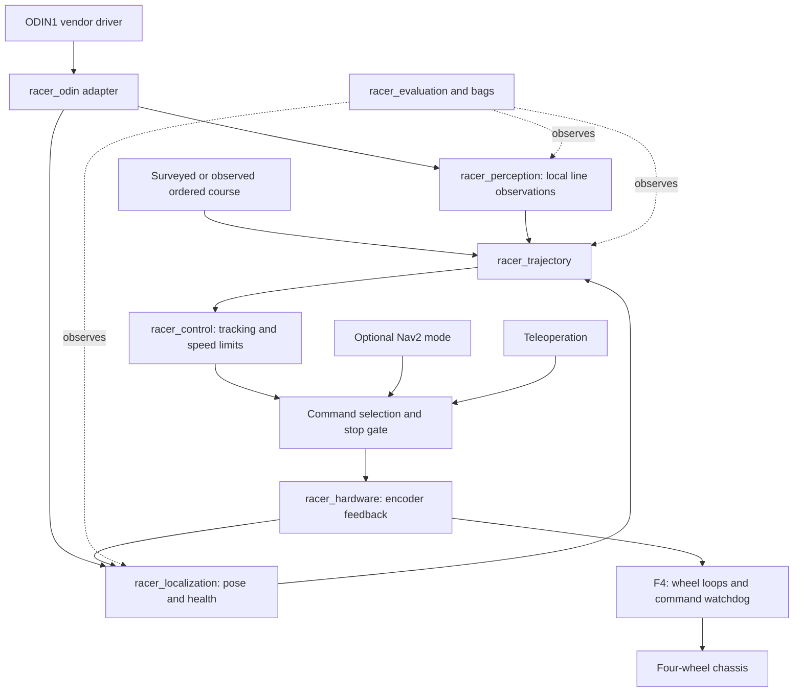

# System architecture

English | [Chinese](02_architecture_cn.md)

## Data and command flow

The diagram shows the target architecture. Available components are model preview,
the standalone Odin sensor bench, chassis contact and ros2_control motion simulation,
and offline error evaluation. Onboard sensors are integrated; perception and route tracking nodes,
race state management and F4 communication remain unimplemented.
See [source navigation](../src/README.md) for package status.

Motion simulation can select the [competition drawing scene](../simulation/COMPETITION_COURSE.md),
providing line images, CameraInfo, IMU, clouds, TF, odometry and velocity commands as a foundation
for local visual tracking development. The course is not surveyed; Gazebo truth and the overhead
camera are independent validation inputs, not tracking-algorithm inputs.



Only the selected operating mode can command the motor adapter. Race control,
teleoperation and optional Nav2 never directly share the final actuator topic.
The F4 lower-level controller owns the final command-age watchdog; a ROS process alone
cannot guarantee a stop when the host freezes. Its reset state is motor-disabled.

## Compute boundaries

| Layer | Responsibility | Initial rate budget, subject to measurement |
| --- | --- | --- |
| F4 lower-level controller | Left/right wheel velocity feedback, limits, communications watchdog | 100-500 Hz if supported |
| Jetson hardware interface | Commands, wheel states, device diagnostics | 50-100 Hz |
| Jetson state estimation | Time-aligned body pose and health | 50-100 Hz |
| Jetson local vision | Ground projection, line candidates, confidence | Measure actual RGB rate; target 20-30 Hz if available |
| Jetson route tracking | Progress-constrained association and speed command | 50 Hz initial budget |
| Development workstation | Bags, calibration, experiments and optional simulation | Offline |

These are proposed loop budgets. They are not claims about ODIN1 output rates.
An estimator running at 100 Hz does not turn old camera samples into fresh data.
Profile acquisition-to-actuation delay, not only callback frequency.

## Coordinate frames and authority

Follow ROS body conventions: x forward, y left, z up, SI units. Camera optical
frames use x right, y down, z forward. The proposed global tree is:

```text
map                         course/world reference when alignment is available
  odom                      continuous local reference
    base_link               chosen body/control origin
      wheel_*_link          measured wheel transforms
      odin_link             measured mounting transform
        odin_camera_optical_frame
```

The current model places `base_link` at the midpoint of the rear drive axle.
Verify this reference on hardware, with the judged point represented by a measured
fixed offset if needed. The front ball transfers are passive supports and receive
no drive command.

`robot_state_publisher` owns body/joint transforms. The local estimator owns
`odom -> base_link`. A separately validated global alignment owns `map -> odom`.
The ODIN1 adapter transforms vendor frames and timestamps; audit and disable
conflicting vendor TF broadcasts before adopting this tree. Every transform
has one publisher. If global alignment is unavailable, omit `map -> odom`
and operate explicitly in a local reference; do not publish a fictitious identity.

ODIN1 pose can contain its own IMU information. Do not fuse the same sensor's
pose and raw IMU as independent measurements without accounting for correlation.
Begin with a measured wheel-based local estimate and a separately characterized
ODIN1 pose reference. Choose fusion inputs after inspecting covariances and drift.
Loop-closure jumps must not appear as instantaneous physical velocity.

In the current motion simulation, `diff_drive_controller` publishes `odom -> base_link`
from wheel position feedback, and `robot_state_publisher` publishes internal transforms
on `/sim/racer/tf` and `/sim/racer/tf_static`. Simulated sensor frames use `odin_sim_*`
names; the vehicle publishes images, clouds and IMU under `/sim/racer/odin1` by default. Gazebo world truth
is used independently for validation, not as wheel-odometry input. Neither
`world -> odom` nor `map -> odom` is published. Assign TF ownership explicitly when
adding a localization node.

## Operating states, proposed

`DISARMED -> READY -> RUNNING -> FINISHED`; faults enter `STOPPED` and require
explicit re-arming after healthy data and a new start decision. `READY` requires
valid geometry, fresh observations appropriate to the selected mode, controller
health and a valid route. Localization-only fallback needs its own bounded trial;
it is not enabled automatically after line loss.

The race state machine above is not implemented. Simulation startup only activates
the joint state broadcaster and differential drive controller, then waits for external
stamped velocity commands without sending nonzero velocity automatically. Its command
timeout uses simulation time and does not replace the independent F4 watchdog.
Future race launch must reject incomplete calibration and must never arm motors as
a side effect of startup. See [simulation documentation](../simulation/README.md)
for available entry points and validation scope.
