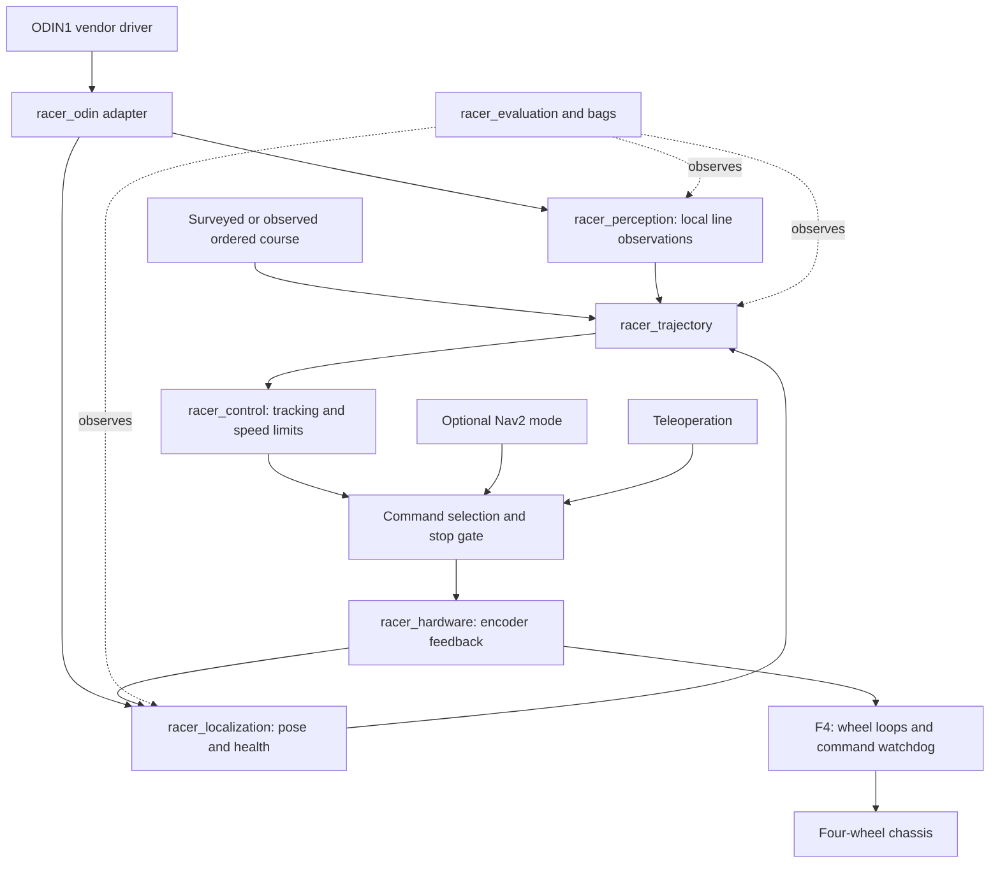

# System architecture

## Data and command flow



Only the selected operating mode can command the motor adapter. Race control,
teleoperation and optional Nav2 never directly share the final actuator topic.
The F4 lower-level controller owns the final command-age watchdog; a ROS process alone
cannot guarantee a stop when the host freezes. Its reset state is motor-disabled.

## Compute boundaries

| Layer | Responsibility | Initial rate budget, subject to measurement |
| --- | --- | --- |
| F4 lower-level controller | Left/right wheel velocity feedback, limits, communications watchdog | 100-500 Hz if supported |
| Jetson hardware interface | Commands, wheel states, device diagnostics | 50-100 Hz |
| Jetson state estimation | Time-aligned body pose and health | 50-100 Hz |
| Jetson local vision | Ground projection, line candidates, confidence | Measure actual RGB rate; target 20-30 Hz if available |
| Jetson route tracking | Progress-constrained association and speed command | 50 Hz initial budget |
| Development workstation | Bags, calibration, experiments and optional simulation | Offline |

These are proposed loop budgets. They are not claims about ODIN1 output rates.
An estimator running at 100 Hz does not turn old camera samples into fresh data.
Profile acquisition-to-actuation delay, not only callback frequency.

## Coordinate frames and authority

Follow ROS body conventions: x forward, y left, z up, SI units. Camera optical
frames use x right, y down, z forward. The proposed global tree is:

```text
map                         course/world reference when alignment is available
  odom                      continuous local reference
    base_link               chosen body/control origin
      wheel_*_link          measured wheel transforms
      odin_link             measured mounting transform
        odin_camera_optical_frame
```

`base_link` is proposed at the midpoint of the rear drive axle, with the judged
point represented by a measured fixed offset if needed. The front casters are
passive and receive no drive command.

`robot_state_publisher` owns body/joint transforms. The local estimator owns
`odom -> base_link`. A separately validated global alignment owns `map -> odom`.
The ODIN1 adapter transforms vendor frames and timestamps; audit and disable
conflicting vendor TF broadcasts before adopting this tree. Every transform
has one publisher. If global alignment is unavailable, omit `map -> odom`
and operate explicitly in a local reference; do not publish a fictitious identity.

ODIN1 pose can contain its own IMU information. Do not fuse the same sensor's
pose and raw IMU as independent measurements without accounting for correlation.
Begin with a measured wheel-based local estimate and a separately characterized
ODIN1 pose reference. Choose fusion inputs after inspecting covariances and drift.
Loop-closure jumps must not appear as instantaneous physical velocity.

## Operating states, proposed

`DISARMED -> READY -> RUNNING -> FINISHED`; faults enter `STOPPED` and require
explicit re-arming after healthy data and a new start decision. `READY` requires
valid geometry, fresh observations appropriate to the selected mode, controller
health and a valid route. Localization-only fallback needs its own bounded trial;
it is not enabled automatically after line loss.

The foundation only provides model preview. Future race launch must reject
incomplete calibration and must never arm motors as a side effect of startup.
