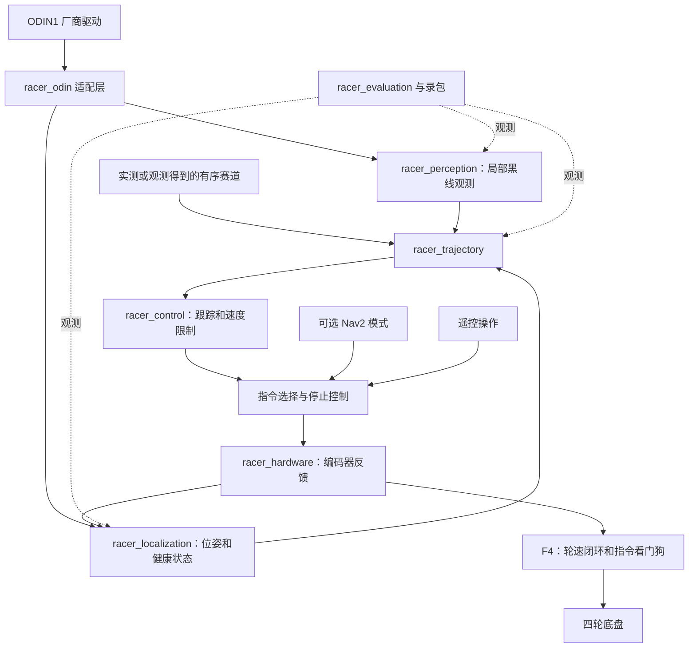

# 系统架构

[English](02_architecture.md) | 简体中文

## 数据和控制指令流



只有当前选中的运行模式可以向电机适配层发指令。比赛控制、遥控和可选 Nav2 不会直接共用最终执行器话题。最终的指令时效看门狗由 F4 下位机负责；仅靠 ROS 进程无法保证上位机卡死时停车。下位机复位后的状态应为电机未使能。

## 计算分工

| 层级 | 职责 | 初始频率预算，需实测确认 |
| --- | --- | --- |
| F4 下位机 | 左右轮速度反馈、限幅、通信看门狗 | 硬件支持时为 100–500 Hz |
| Jetson 硬件接口 | 指令、车轮状态、设备诊断 | 50–100 Hz |
| Jetson 状态估计 | 时间对齐的车体位姿和健康状态 | 50–100 Hz |
| Jetson 局部视觉 | 地面投影、黑线候选、置信度 | 测量实际 RGB 帧率；条件允许时目标为 20–30 Hz |
| Jetson 路线跟踪 | 受进度约束的关联和速度指令 | 初始预算为 50 Hz |
| 开发工作站 | 录包、标定、实验和可选仿真 | 离线 |

以上是拟定控制循环预算，并非 ODIN1 实际输出频率的声明。估计器以 100 Hz 运行，不会让旧相机数据变成新数据。应测量从采集到执行的延迟，而不只是回调频率。

## 坐标系及发布归属

遵循 ROS 车体坐标约定：x 向前、y 向左、z 向上，使用 SI 单位。相机光学坐标系为 x 向右、y 向下、z 向前。拟定全局坐标树如下：

```text
map                         完成对齐后使用的赛道/世界参考系
  odom                      连续的局部参考系
    base_link               选定的车体/控制原点
      wheel_*_link          实测车轮变换
      odin_link             实测安装变换
        odin_camera_optical_frame
```

拟将 `base_link` 放在后驱动轴中点；必要时用实测固定偏移表示评分参考点。前万向轮是被动轮，不接收驱动指令。

车体与关节变换由 `robot_state_publisher` 发布。局部估计器负责 `odom -> base_link`。经过单独验证的全局对齐模块负责 `map -> odom`。ODIN1 适配层转换厂商坐标和时间戳；采用此树前，要检查并关闭冲突的厂商 TF 广播。每条变换只能有一个发布者。如果没有全局对齐，就省略 `map -> odom` 并明确使用局部参考系，不能伪造单位变换。

ODIN1 位姿可能已包含其自身 IMU 信息。没有考虑相关性时，不能把同一传感器的位姿和原始 IMU 当成独立观测融合。先建立基于实测车轮反馈的局部估计，并独立表征 ODIN1 位姿参考；检查协方差和漂移后再选融合输入。闭环校正引起的位姿跳变不能被当成瞬时物理速度。

## 拟定运行状态

`DISARMED -> READY -> RUNNING -> FINISHED`；发生故障后进入 `STOPPED`，数据恢复健康并重新确认开始后，才可明确重新使能。`READY` 要求几何参数有效、当前模式所需观测新鲜、控制器健康且路线有效。仅靠定位的降级模式需要单独进行有限范围试验，不能在线丢失后自动启用。

基础工程目前只提供模型预览。后续比赛启动流程必须拒绝不完整标定，且不能因启动程序就自动使能电机。
