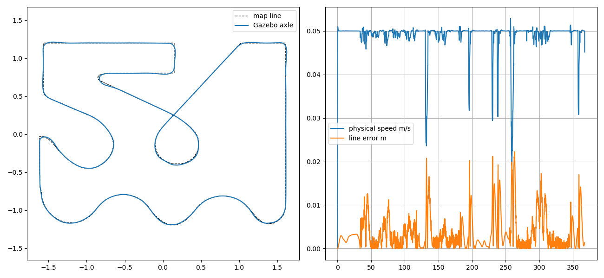

# 比赛地图连续整圈：验收结果

[English](RESULTS.md) | 简体中文

当前汇总：初始验收通过，随后 0.05 m/s 三次重复全部通过，0.10 m/s 单次通过。下表记录初始验收，后续章节记录重复与提速结果。

**已通过一次完整 Gazebo 连续整圈验收：185/185 个顺序检查点通过，中途未停车，终点自动停车。**

| 指标 | 实测 |
| --- | --- |
| 有序参考路线长度 | 18.440 m |
| 完成时间（仿真时间） | 367.29 s |
| 轮轴偏线 RMS / 最大值 | 5.32 / 22.25 mm |
| 行驶阶段最低实测平移速度 | 19.13 mm/s |
| 最大有效图像健康观测年龄 | 0.18 s |
| 最长视觉位置校正年龄 | 7.05 s；期间图像健康和轮式里程计持续更新 |
| 检查点 | 185/185 |
| 中途停车 / 终点物理停车 | 无 / 通过 |

## 验收范围

采用预录有序路线、车载 FishPoly 图像校正和轮式里程计，主体 C++ 实现。
地图、车辆和相机未改变；Gazebo 真值只进入独立 Python 评测器。
从右侧直线朝下出发，经过底部波浪、左侧回弯、左上矩形、中央小环及两次交叉通行，返回起点。

运行前固定门限：每100 mm一个顺序检查点、100 mm检查半径；全程轮轴偏线最大100 mm、时间加权RMS50 mm。
起步1 s之后至终点停车前，所有实测平移速度须大于3 mm/s，所有指令线速度须为正。
本次共记录6619个轨迹样本，排除起步和终点后的6599个行驶样本全部满足不停驶检查。
终点在起点附近的25 mm路线进度容差内判定，独立位置检查半径为100 mm；不要求数学意义上的完全重合。

本次是单次选定路线仿真验收，不代表重复稳定性、实车、车体比赛走廊或正式比赛路线顺序验收。
最大误差22.25 mm也不表示轮轴始终位于约21 mm黑色笔画内部。

## 版本与复现

[运行和验证说明](../../simulation/COMPETITION_LAP_cn.md) | [机器可读汇总](results.json)

完整报告：`data/generated/competition_lap/attempt07/index.html`；同目录包含`report.json`、`trajectory.png`、`launch.log`、
`source_manifest.json`和`final_source/`。主控制器、路线头文件、路线数据及运行二进制均已在运行后核对摘要一致。
大型原始报告保留本地，本页图像与摘要纳入源码管理范围。

此前失败保留在同级目录：早期单分支观测不足导致距离限值停车；`attempt04`因启动期旧帧锁存未起步；
`attempt06`在中央小环后错误匹配可见的其他路线段，最大偏线188.88 mm后停车。
最终修改为以完整地图做视觉定位，以有序进度窗口约束控制选路。验收门限未放宽。
`attempt01`评测器序列化失败，记录不完整，不计入任何成功结果；`attempt05`因测试端口占用未启动。

## 名义起点重复验收

同一程序和参数独立启动3次，全部通过整圈、不停驶和终点停车验收。每次185/185检查点通过。

| 次数 | 时间/s | RMS/mm | 最大误差/mm | 最低行驶速度/mm/s |
| --- | --- | --- | --- | --- |
| run_01 | 367.31 | 5.27 | 22.07 | 19.17 |
| run_02 | 367.36 | 5.27 | 22.19 | 19.01 |
| run_03 | 367.26 | 5.30 | 21.97 | 19.47 |

三次完整指令流检查也通过，中途没有非正向速度指令。名义起点重复性已验证；任意起点、扰动和实车仍未验证。机器可读汇总：[repeat_results.json](repeat_results.json)。原始总报告：`data/generated/competition_lap/repeat_nominal_01/index.html`。本轮Python回归41项通过。

## 0.10 m/s 单次提速测试

仅把速度设置改为0.10 m/s，前视保持0.10 m，验收门限不变。全部通过，185/185检查点，中途不停，终点停车。

- 圈时：197.43 s，比0.05 m/s三次基线平均缩短46.2%。
- 偏线RMS / 最大值：5.60 / 24.14 mm。
- 最低行驶速度：16.71 mm/s；紧弯自动减速，并非全程0.10 m/s。
- 完整指令流检查：14405条中途指令，无零速或反向。

[机器可读结果](speed_010_results.json)。原始报告：`data/generated/competition_lap/speed_010_01/index.html`。仅验证一次，默认启动速度仍为0.05 m/s，未修改控制器。
