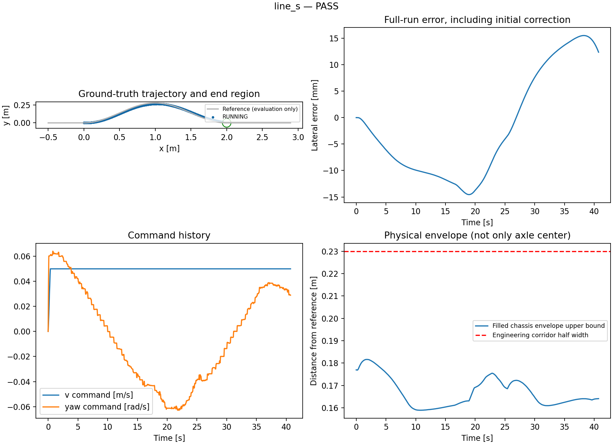
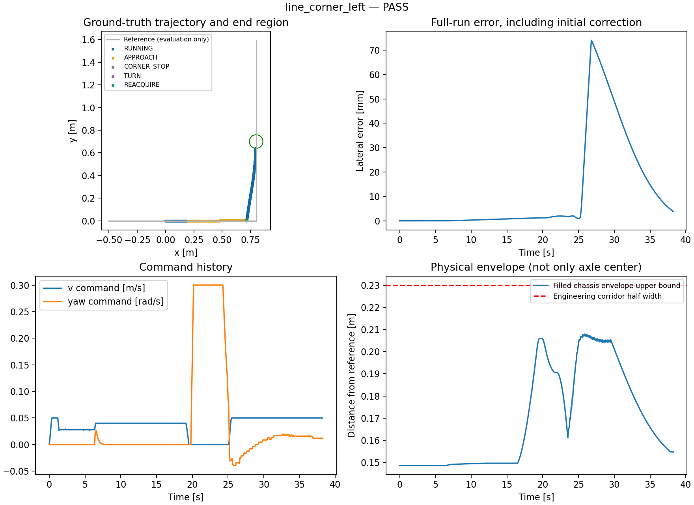
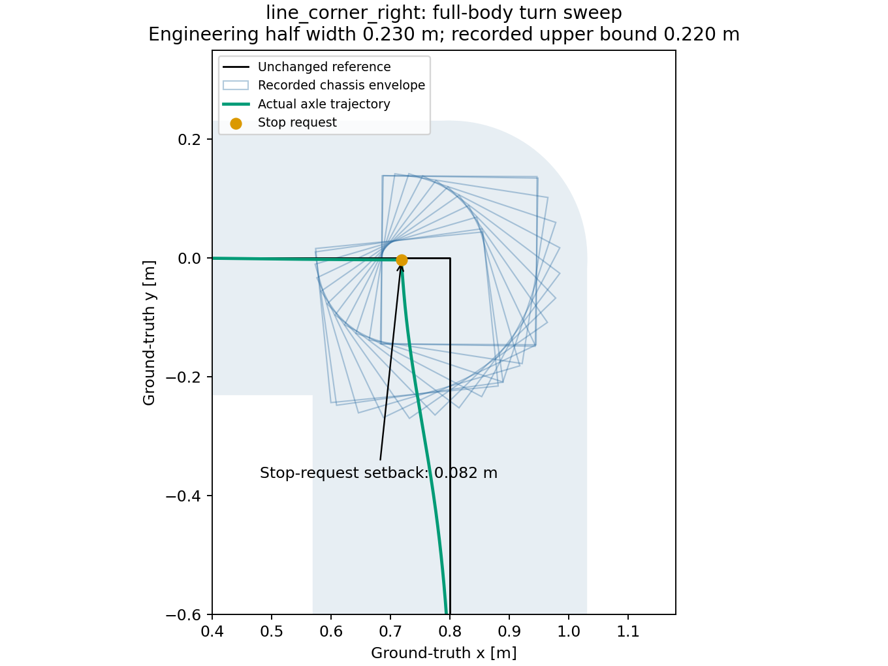
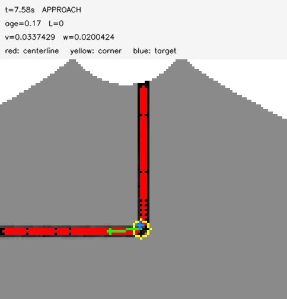

# 独立场景视觉循线：交付结果

[English](RESULTS.md) | 简体中文

最终冻结版本通过 **42/42 次跟踪验收和 12/12 次故障验收**。54 次运行使用同一二进制版本，
归档源码在冻结时与工作区一致。此后比赛地图生成与说明已更新为默认2倍、固定线宽；
感知、控制与评测算法未变；提交前清理了控制头文件和评测脚本的空白字符。`results.json`中的源码一致性字段为冻结时记录，不是对当前工作区的实时检查。本结论针对现有车辆的 Gazebo 仿真及工程测试走廊，
不代表实车性能或正式比赛合规性。

[固定标准](acceptance.json) | [机器可读结果](results.json) |
[实现与启动](../../simulation/LINE_FOLLOWING_cn.md) |
[独立评测与复现](../../simulation/ISOLATED_LINE_VALIDATION_cn.md)

## 固定参数跟踪结果

每个场景包括居中两次、左右偏移各35 mm、正负航向偏差各0.08 rad。下表各列取该场景六次运行
中的最差值，单位均为毫米。RMS/P95按实际时间加权，包含初始纠偏。

| 场景 | 通过 | 全程RMS | 全程P95 | 全程最大 | 末段RMS | 扫掠保守上界 |
| --- | --- | --- | --- | --- | --- | --- |
| `line_straight` | 6/6 | 17.53 | 34.81 | 35.00 | 3.73 | 185.73 |
| `line_arc` | 6/6 | 13.53 | 34.18 | 35.00 | 5.41 | 212.07 |
| `line_left` | 6/6 | 17.05 | 34.93 | 35.00 | 7.54 | 212.08 |
| `line_right` | 6/6 | 16.85 | 34.73 | 35.00 | 6.20 | 212.20 |
| `line_s` | 6/6 | 17.45 | 34.70 | 35.11 | 13.86 | 213.50 |
| `line_corner_left` | 6/6 | 29.59 | 65.00 | 75.46 | 43.40 | 220.31 |
| `line_corner_right` | 6/6 | 29.99 | 66.77 | 78.48 | 44.47 | 222.28 |

15 mm末段RMS门槛只用于直线/圆弧回归。S弯和直角使用全程RMS/P95/最大误差60/100/140 mm、
固定230 mm走廊半宽、顺序路径门及结束区域共同验收。最大有效观测年龄为0.21秒，
低于0.35秒限制；速度、角速度、线加速度和角加速度分别通过0.05 m/s、0.5 rad/s、0.15 m/s²和0.8 rad/s²限制。

最终角点前停车距离为80 mm，零平移指令低速转向，连续三帧重新观察到出口后恢复跟踪。
重新贴近出口会产生约75–78 mm峰值偏差，已计入全程误差，没有用末段统计掩盖。
原始报告按控制状态划分阶段：REACQUIRE结束后的纠偏属于正常跟踪阶段。
车体扫掠使用含车轮和前板的填充包络，并加上空间采样和相邻时刻运动覆盖误差；
最差最终上界为222.28 mm，低于预先固定的230 mm半宽。

## 故障与专项回归

每一行是独立启动的仿真，均在实际进入指定运动阶段后注入故障。全部在0.6秒内请求停车，
通过1.2秒后的物理停车检查，并在输入恢复后1秒内保持锁止。主动转角停车CORNER_STOP与故障STOPPED分离。
下表延迟按注入至收到STOPPED通知计量。

| 阶段与故障 | 停车请求延迟/秒 | 实际停车及恢复锁止 |
| --- | --- | --- |
| `RUNNING_drop` | 0.29 | PASS |
| `RUNNING_blank` | 0.29 | PASS |
| `RUNNING_tf` | 0.40 | PASS |
| `RUNNING_odom` | 0.17 | PASS |
| `APPROACH_drop` | 0.29 | PASS |
| `APPROACH_blank` | 0.35 | PASS |
| `APPROACH_tf` | 0.35 | PASS |
| `APPROACH_odom` | 0.17 | PASS |
| `TURN_drop` | 0.27 | PASS |
| `TURN_blank` | 0.32 | PASS |
| `TURN_tf` | 0.37 | PASS |
| `TURN_odom` | 0.22 | PASS |

最终版本还通过35项Python测试、21项C++测试用例（colcon含两个测试套件结果共报23项）、
17项合成ROS控制异常检查和20次量化时钟重复使能测试。
保存的静止左右角点及S弯地面图也通过最终C++离线感知程序重放验证。

## 改进前基线、失败记录与原始证据

未改算法的七场景基线为3次通过、4次失败：原圆弧及左右圆弧通过；两个直角在横向宽黑区停车；
直线、S弯各有一次缺失TF停车。原源码、二进制摘要、图像、失败位置与原因均保留。
这些单次基线用于定位问题，不与最终重复矩阵做严格统计成功率对比。

`data/generated/isolated/`保留全部开发失败和此前中断的冻结轮次，包括起点/分支误判、
入口方向支撑不足、评测TF中继延迟、18 mm停车方案的282 mm扫掠上界、公共线段端点浮点遗漏，
以及使能时钟量化导致起步加速度超限。修改了停车位置和实现，没有改参考线、放宽走廊或验收门槛。
这些旧版本运行不计入最终54次验收。

最终原始证据位于`data/generated/isolated/validated/`，包含`index.html`、`final_summary.json`、
`final_curves/`、`final_turns/`、`final_faults/`、`offline/`及`final_source/`。
逐次JSON保留真值样本、全部接收指令、分阶段误差、状态变化、停车位置及逐项检查；PNG包括原图、实际输入、
掩膜、地面投影和几何调试图。图像每仿真秒及状态变化保存，并非无损全帧录像。
完整归档为`data/generated/isolated_delivery.tar.gz`。生成数据按仓库策略不纳入Git；本页小图和数值汇总纳入源码。
启动和复现命令见前述中英文说明。
