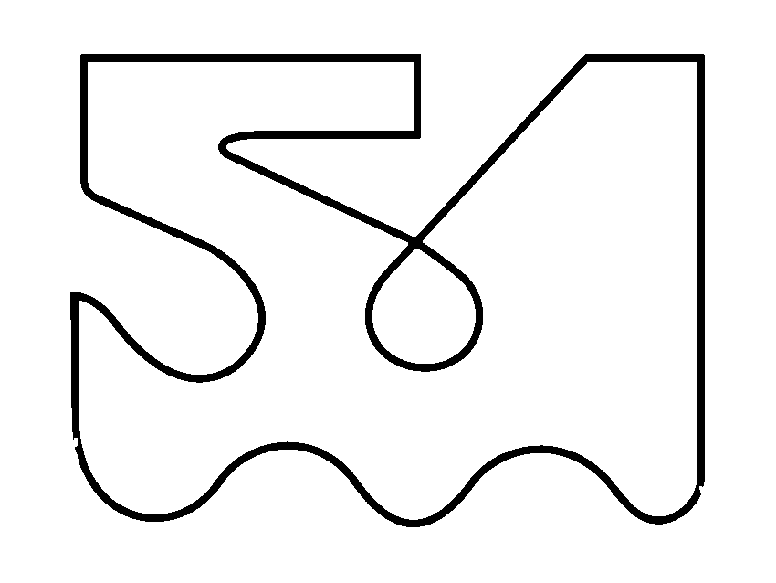

# 比赛参考图赛道世界

[English](COMPETITION_COURSE.md) | 简体中文

已根据仓库的[比赛参考图](../tracks/reference/course_reference.jpg)搭建完整 Gazebo 赛道，
保留直线、中央交叉点、回环、紧弯和下方连续 S 弯。整车沿用现有动力学、ros2_control 和
随车 Odin 图像、CameraInfo、点云、IMU。已实现单分支低速视觉循线，见[循线说明](LINE_FOLLOWING_cn.md)；完整路线与交叉点选路尚未完成。

## 启动

从工作空间根目录执行：

```bash
source /opt/ros/humble/setup.bash
colcon build --base-paths src --packages-select racer_description racer_control racer_bringup
source install/local_setup.bash
ros2 launch racer_bringup simulation.launch.py course:=competition
```

默认打开 Gazebo，并启用随车传感器。车辆放在上方直线，面向参考图右方；启动后等待速度指令。
`course:=empty` 为原有空场默认值，`sensors:=false` 可关闭随车传感器。
`gui:=false` 关闭 Gazebo 窗口，但相机仍需可用的 DISPLAY/渲染环境。
比赛场景不可同时使用 `sensor_targets:=true`，防止已知目标测试物混入赛道。

随车话题及 RViz 设置沿用[仿真说明](README_cn.md)。使用 RViz 的 Image 显示：
话题 `/sim/racer/odin1/image`，Reliable、Volatile、depth=5，`use_sim_time=true`。
黑线由相机观察；目前射线点云不模拟黑白材料的反射强度，因此不会显示黑线形状。

需要俯视图时，启动参数增加 `course_overview:=true`，订阅
`/sim/course/overview/image`（1000×750、2 Hz、Reliable），CameraInfo 为
`/sim/course/overview/camera_info`。该固定相机只用于场景检查，不属于 Odin，也不接入感知算法。
它使用独立 frame 名称，当前没有发布相应 TF；在 RViz 中使用 Image 显示即可。

## 比例、坐标与近似

| 项目 | 当前实现 |
| --- | --- |
| 赛板 | 默认2倍比例：4.00 × 3.00 m 白色平面，中心为世界原点；原始资源为2.00 × 1.50 m |
| 坐标 | 图右为 +X，图上为 +Y，向上为 +Z |
| 提取 | 原图 905×738；赛板裁剪区域 `[9,90,859,728]`，右/下边界不包含，得到 850×638 纹理 |
| 黑线 | 原始提取去掉文字、标注和边框；默认运行时按连通骨架重绘约21.2 mm线宽，与地图比例独立 |
| 像素比例 | 原始纹理X/Y均约2.35 mm/px；运行纹理采用4倍像素分辨率，默认2倍地图约1.18 mm/px |
| 黑线外包络 | 原始资源约1.635 × 1.218 m，非当前运行尺寸；未强制对齐红色标注，运行时中心线随比例缩放、线宽独立 |
| 默认车体位置 | `base_link` 初始 X≈−1.1929 m、Y≈1.2014 m、yaw=0；释放高度沿用底盘接触模型 |
| 地面 | 黑白区域共用原有平面接触和摩擦；赛板纹理在 Z=0.2 mm，无额外碰撞体 |

白色底板与黑线一起作为视觉网格加载，外围为灰色地面。物理地面仍为原有 20×20 m 场景平面；
没有赛板边缘台阶、围栏、出界阻挡或自动判罚。车体有一部分可能伸出白板，不能据此认定符合比赛规则。
照明为固定的基础场景，没有模拟光照变化、污渍或实际印刷材料。

本版本是 **参考图复刻，未经实物测量标定**。标注范围可能采用不同的边界定义，图像也有像素误差；
目前按外部赛板尺寸换算，保留原图内部比例。黑线宽度、起终点、行驶方向、交叉点通过顺序仍需确认。
默认位置只是调试出生点，不是正式比赛起点。未修改[实测路线模板](../tracks/competition/course.template.yaml)，
也没有生成可当作实车真值的有序中心线。



## 生成与修改

- [提取参数](../tracks/competition/reference_reconstruction.yaml)：原图路径、赛板裁剪、尺寸和调试出生点。
- [生成脚本](../tools/generate_competition_course.py)：输出 PNG、米制 COLLADA 平面和带来源哈希的配置。
- [生成配置](../src/odin_racer/racer_description/config/competition_course.yaml)：比例、线宽估计、出生点和来源状态。
- [场景组装](../src/odin_racer/racer_description/racer_description/course_world.py)：把赛道加入可驱动整车世界。

原始纹理和网格已入库，运行无需重新提取。默认运行时使用OpenCV生成固定米制线宽的临时纹理及网格引用。
`course_parameters`支持`scale`（默认2.0）、`line_width`（默认约0.02116 m）和`spawn_x/y/yaw`。
默认出生点随比例缩放；显式出生坐标为世界米制坐标，不再乘比例。右上角对应位置示例见[循线说明](LINE_FOLLOWING_cn.md#放大地图并保持原线宽)。
修改提取参数后执行以下命令并重新构建、启动：

```bash
# 地图运行时重绘、资源生成及图像验证需要这些依赖。
sudo apt-get install python3-opencv python3-numpy python3-yaml
python3 tools/generate_competition_course.py
```

不得把图像提取配置替换为实测路线的验收依据；获得矢量原图或实测数据后再修订比例和线宽。

## 验证

使用专用 ROS domain 和 Gazebo 端口，新启动世界，勿同时运行其他速度发布者：

```bash
source /opt/ros/humble/setup.bash
source install/local_setup.bash
export ROS_DOMAIN_ID=74
export GAZEBO_MASTER_URI=http://127.0.0.1:11356
ros2 launch racer_bringup simulation.launch.py course:=competition course_overview:=true gui:=false \
  course_parameters:='{scale: 1.0}'
```

另一终端加载同一 ROS 环境、工作空间和 `ROS_DOMAIN_ID=74` 后执行：

```bash
python3 tools/validate_competition_course.py
```

此历史投影验证程序读取原始资源坐标，必须使用上面的`scale: 1.0`；它不验收默认2倍地图。
验证程序在上方直线以 0.08 m/s 指令行驶 1.5 仿真秒后停车；重复验证前重启世界。
它比较俯视图与地图纹理的黑线重合度，并用 CameraInfo、TF 和停车后的 Gazebo 位姿
检查随车图像投影；同时检查点云地平面、静止 IMU、传感器频率及短距离前进。
俯视比较排除车体与阴影区域；随车比较只覆盖前方 1 m 内有用视野，不是全赛道可见性验收。
JSON 报告及前后两组 PNG 保存至 `data/generated/competition_course_validation*`。

历史记录（2026-09-13，旧针孔版本；新结果见 [FishPoly 验收](FISHPOLY_CAMERA_cn.md)）：实际前进约 0.116 m；两次俯视黑线 IoU 约 0.853/0.851，
随车投影 IoU 约 0.926/0.933（阈值分别为 0.85/0.70，受纹理采样和渲染边界影响）。
图像、CameraInfo 和点云实收约 10 Hz，俯视图约 2 Hz，IMU 约 333 Hz，均按仿真时间计。
IMU 配置目标为 400 Hz，本场景未实收到该频率；频率检查允许目标值 ±20%。
本次实时因子约 0.84，是当前电脑、场景与验证负载下的结果，不代表 Jetson 性能。

结构测试为 `tests/test_course_world.py`；运行方式：

```bash
python3 tools/check_workspace.py
python3 -m unittest discover -s tests -v
```

原有 `validate_sim_sensors.py` 依赖空场中的红/蓝测试物，`validate_sim_drive.py` 也按空场原点设计，
不用于比赛赛道。当前验收证明场景加载、纹理投影和基础运动可用，不能证明自主跑圈、交叉点选择或实车一致性。
